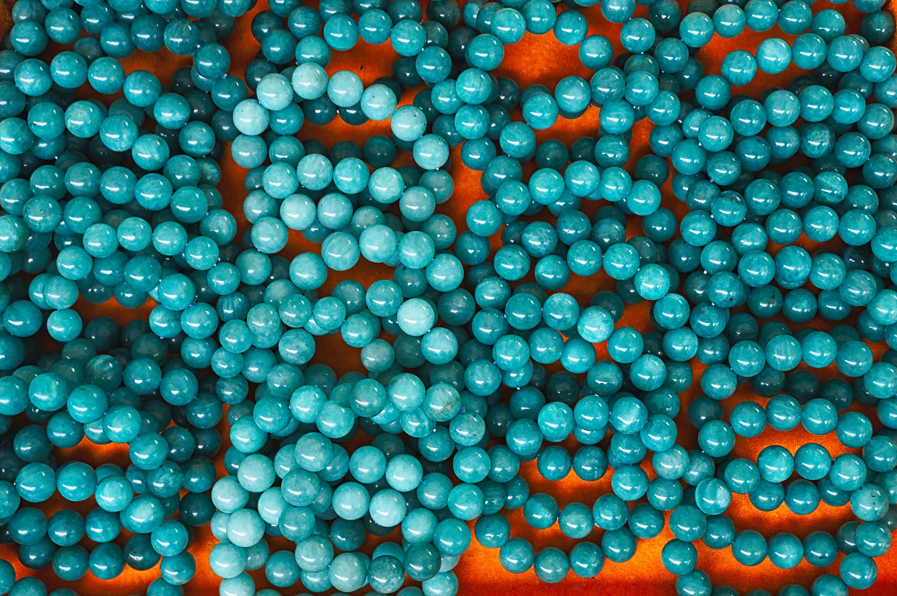

# Ruby for Pirates

---

## Object Oriented Programming (OOP)

---

---

## Everything in Ruby is an Object

---

## Classes vs. Objects

---

---

# Defining a class

---

## Methods on classes

---

## Instance Variables (or Attributes)

---

## The `initialize` Method

---

# @tammam on Twitter

---