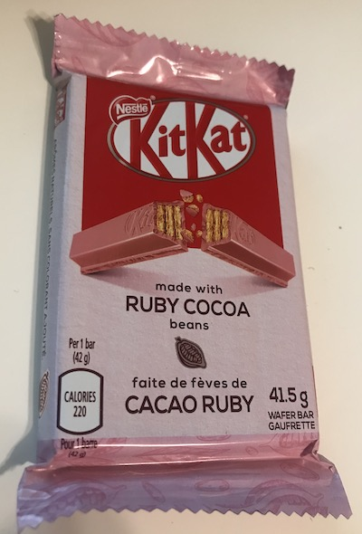

# Ruby for Pirates

## Numbers!

---

## Today's Fun Fact

---

# Hello Again

---

## Before we start, 
##  a few things

---

# Printing in Ruby

---

# Comments in Ruby

---

# Numbers

---

# Numbers are values

---

# Basic Operations

---

# %

---

# Types of numbers

---

# Using the `Math` class

---

# Using the `Math` class

---

## Documentation

---

# Today's challenge
## What is 0.1 + 0.2

---

# @tammam on Twitter

---